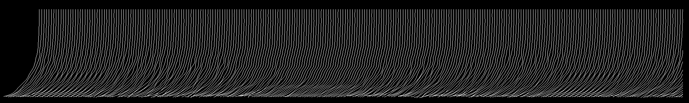

# Simulation of inextensible Hair and Fur

A sample implementation of the hair simulation algorithm presented in the paper 

**Fast Simulation of Inextensible Hair and Fur**

*by M.Müller, T.Y.Kim and N.Chentanez*

For further references see
* https://github.com/derselbst/FurSimulation/raw/master/presentation/presentation.pdf
* http://matthiasmueller.info/publications/FTLHairFur.pdf
* http://youtu.be/zB8Fqbfrrpo
